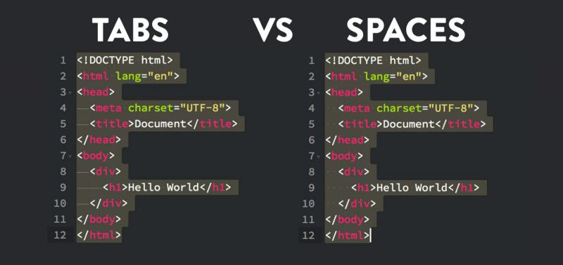

[!INCLUDE [ref-one](ref-one.md)]


Blah blah... blah (see the [Follow this...](ref-two.md) for blah... then blah).
[](./image-three.jpg#lightbox)
[!INCLUDE [ref-three](~/docs-repo/ref-(three).md)]
![image four][1]
[ref four][2]
[ref five][Contact]
blah blah...(blah, ...) see the [ref six](./../subdir/ref-six.md?toc=%2fcli%2fmodule%2ftoc.json) script.

I really like whitespace, ugh! 
<table>
	<tr>
		<td valign="top" width="50%">1.<br/><ul><li>User finds your application in AppSource Web Site</li><li>Selects ‘Free trial’ option</li></ul></td>
		<td valign="top" width="50%">2.<br/><a src="./ref-seven.md" width="85%" alt-text="Shows the Microsoft sign-in page"/><ul><li>User is redirected to Microsoft Sign-in page</li><li>User provides credentials to sign in</li></ul></td>
	</tr>
</table>


```csharp
public static T ThisIsCool<T>() where T : new()
{
	 return new T();
}
```

```c#
Moments later, we realized that this slug is actually not valid.
```
 
```js
{
... { array }
}
```

or is it actually?

```javascript
This might be right?
```

	

[1]: ./image-four.png
[2]: ref-four.md
[Contact]: ./ref-five.md "more blah..."
