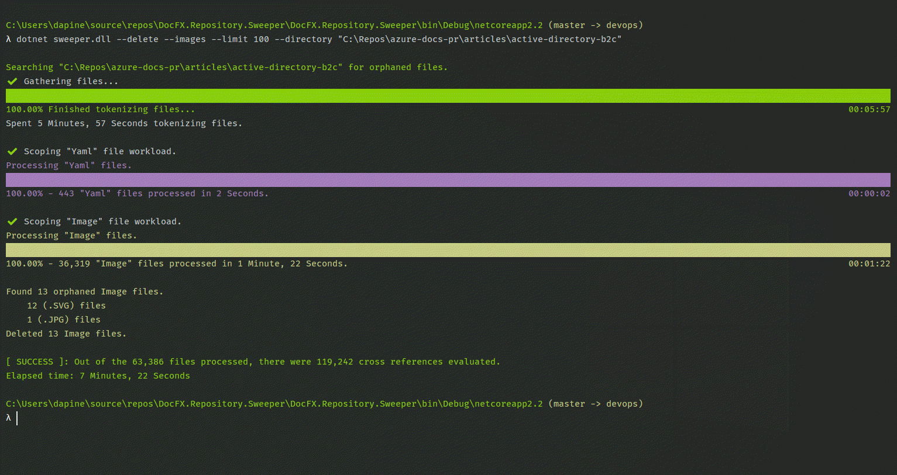

# :metal: DocFX.Repository.Sweeper

The `DocFX.Repository.Sweeper` (**sweeper**) is a tool for sweeping **DocFX** repositories clean of files that are not being used.

> This project was directly inspired by [Genevieve Warren - @gewarren](https://github.com/gewarren) and her amazing [CleanRepo](https://github.com/gewarren/cleanrepo) tool.

## :eyes: First impressions

This command-line tool helps to identify (and optionally delete) files within a **DocFX** repository that are not referenced by any other file.

  - Find (and delete) markdown files not referenced in TOC, index, or other markdown files
  - Find (and delete) image files not referenced in TOC, index, or other markdown files

### The approach

The **sweeper** tool starts execution by validating the command-line arguments. If all the arguments are valid, it will first locate the `docfx.json` file by traversing the source directory (`-s`). The directory where the `docfx.json` file resides is the top-level directory. The source directory (`-s`) should be either a subdirectory or the root (`docfx.json` file top-level) directory. The tool tokenizes all the relevant files into a `FileToken` at the top-level directory.

#### File tokens

File tokens contain various properties about the tokenized file, such as but not limited to:

 - The file type, for example: `Markdown`, `Yaml`, `Json`, `Image`, or `NotRelevant`
 - The file path, fully qualified (based on a `FileInfo` object)
 - Whether or not the file is determined to be "relevant"
 - Lists of other files that they reference (and depend on)

### File definitions

The various file types are taken into consideration.

| File Type | File Extensions |
|--:|:--|
| Markdown | `.md`, `.markdown`, `.mdown`, `.mkd`, `.mdwn`, `.mdtxt`, `.mdtext`, `.rmd` |
| Image | `.png`, `.jpg`, `.jpeg`, `.gif`, `.svg` |
| YAML | `.yml`, `.yaml` |

## :clipboard: Getting started

The **sweeper** executable is a `.NET Core` project and can be executed from the command-line with the `dotnet` CLI. There are several options avialble:

| Option | Description | Default |
|--:|:--|:--|
| `-s`* | The source directory to act on (can be subdirectory or top-level) | `null` | 
| `-t` | If true, finds orphaned topic (markdown) files | `true` |
| `-i` | If true, finds orphaned image files (.png, .jpg, .jpeg, .gif, .svg) | `true` |
| `-d` | If true, deletes orphaned markdown or image files | `false` |
| `-o` | If true, writes various warnings to the standard output | `false` |
| `-r` | If true, writes redirections of deleted files to `.openpublishing.redirection.json` | `false` |
| `-h` | If 'redirects' is true, this is required and is the host where the docs site is hosted | `"https://docs.microsoft.com"` |

> <sup>*</sup> denotes a required option

Executing the following command will find all the files within the `articles` directory that are not referenced anywhere else in the entire repository (relevant to the `docfx.json` file).

```
dotnet sweeper.dll -s "C:\repo\azure-docs-pr\articles\"
```

Here is an example output:



## :poop: Toubleshooting

```
// TODO: add details about using Git to undo issues that may arrise
```

## The future

  - [x] Automatically update the `.openpublishing.redirection.json` when orphaned topics are deleted.
  - [ ] Identity and correct, inproper usage of code fence slugs.
